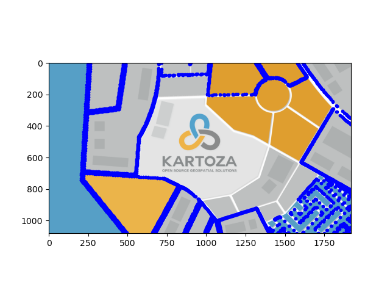
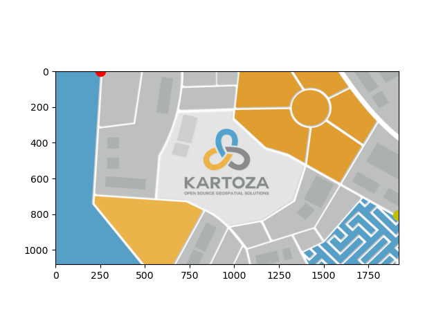
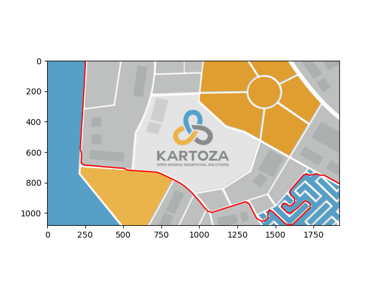
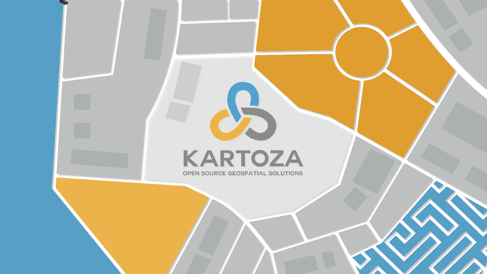

# Car Animation Project

## Requirements

This project aims to create an animation of a car moving along the white roads in a given map image. The car should start at the closest contour point to `(250, 0)` and exit at the closest contour point to `(1920, 800)`. The car's route must always be within 30 pixels of the original contour lines. It may hop from one contour to another if needed to find the shortest path. The car should be visualized as an animated GIF.

## Implementation Approach

1. **Image Processing**:
   - Load the map image and resize it to `1920x1080`.
   - Convert the image to grayscale and threshold it to extract the white roads.
   - Find the contours of the white roads.
   - Break the contours into segments of a maximum length of 20 pixels to ensure a detailed path.

2. **Path Finding**:
   - Identify the starting point closest to `(250, 0)` and the ending point closest to `(1920, 800)`.
   - Construct a graph from the contour segments, where edges exist between points within 30 pixels of each other.
   - Use Dijkstra's algorithm to find the shortest path from the starting point to the ending point.

3. **Animation**:
   - Initialize Pygame and create frames for the animation.
   - Draw the car following the computed path.
   - Save the frames to disk to manage memory usage.
   - Combine the frames into an animated GIF.

4. **Memory Management**:
   - Save intermediate frames to disk to manage memory usage during animation generation.
   - Clean up temporary frames after creating the GIF.

## Example Output

### Initial Contours

The following image shows the initial contours detected in the map. These contours represent the white roads that the car will follow:

### Starting and Ending Points

This image highlights the starting (red) and ending (yellow) points on the map. These points are determined based on their proximity to `(250, 0)` and `(1920, 800)` respectively:

### Selected Path

This image shows the shortest path selected by the algorithm. The path is constructed to remain within 30 pixels of the original contours:

### Final Animation

The following GIF shows the car moving along the white roads from the entry to exit points:

